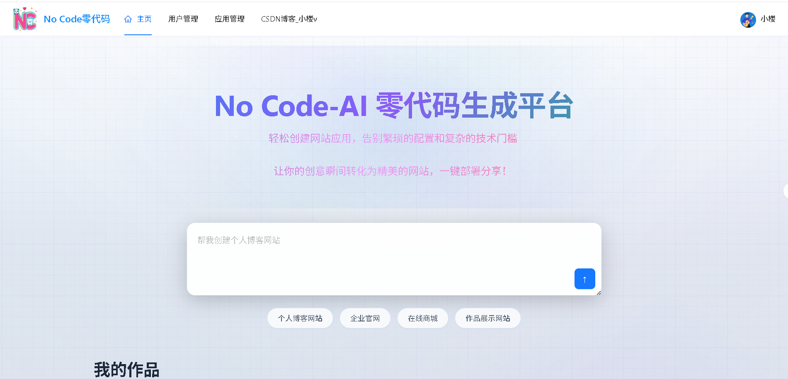
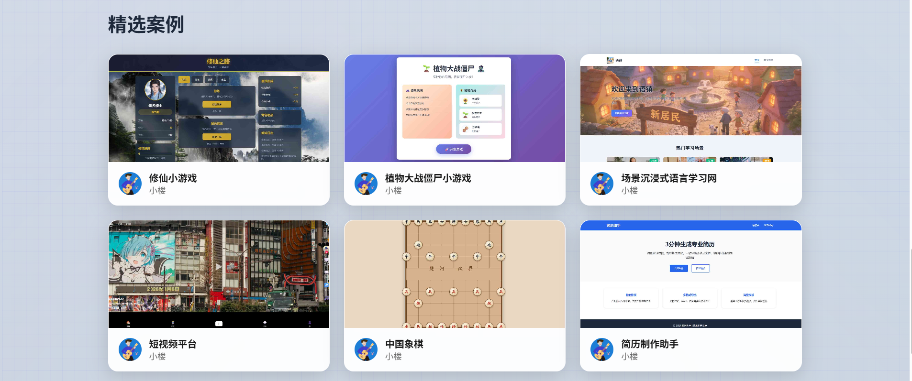
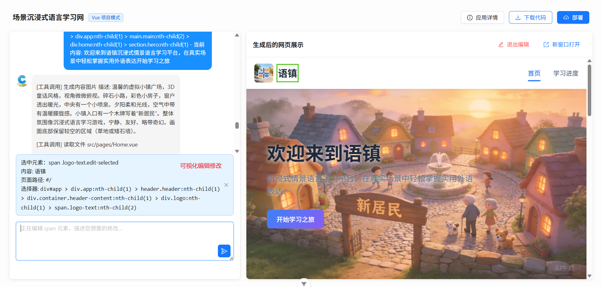
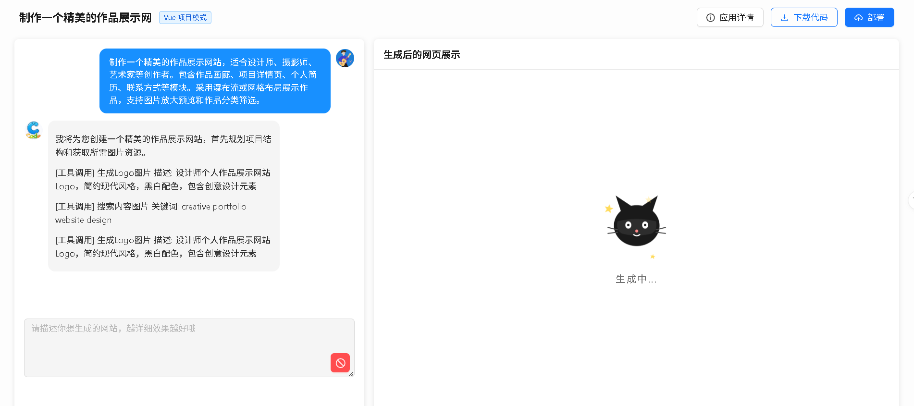
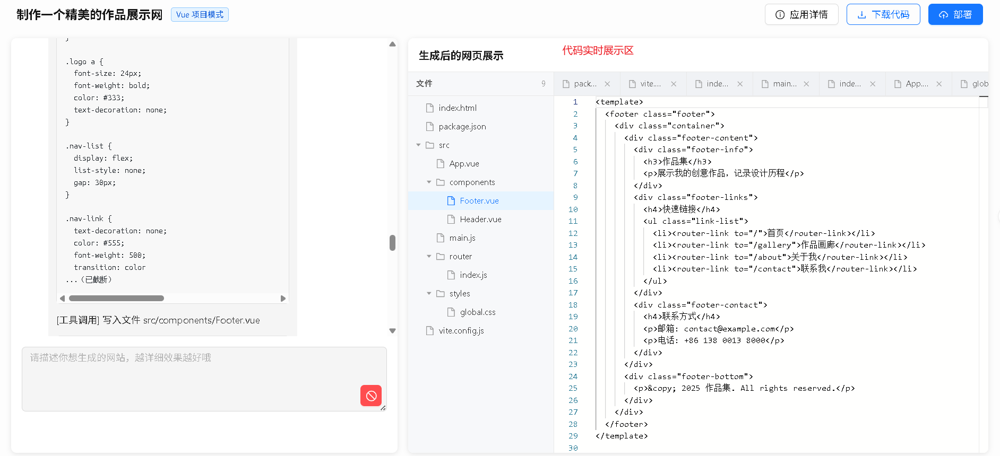
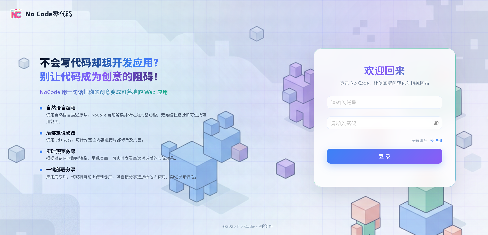

# XiaoLou AI NoCode - AI 驱动的零代码应用生成平台

这是一个用自然语言生成网站应用的平台。用户描述想要什么，AI 直接生成可预览、可下载、可部署的代码。

[](https://www.java.com)
[](https://spring.io/projects/spring-cloud)
[](https://docs.langchain4j.dev)
[](https://redis.io)
[](https://dubbo.apache.org)
[](https://nacos.io)

## 项目简介

核心功能很简单：用户输入一句话，比如"帮我做一个个人博客网站"，系统会自动生成完整的页面代码，支持在线预览、指定修改、代码下载和一键部署。

## 平台预览













技术上做了几件有意思的事：

1. **AI 不只是聊天** — 基于 LangChain4j 构建了 Agent，挂载了文件读写、目录浏览、代码修改等工具，AI 能真正操作文件系统来生成项目
2. **智能路由** — 用一个独立的 AI 模型分析用户需求复杂度，自动决定生成策略：简单需求出单 HTML，中等需求出多文件，复杂需求出完整 Vue 工程
3. **流式输出** — AI 生成的代码通过 SSE 逐 token 推送到前端，用户能实时看到代码在"生长"
4. **可视化编辑** — 用户在预览页面上点击元素，系统能精准定位到对应代码位置，支持针对性修改
5. **安全防护** — LangChain4j Guardrail 拦截 Prompt 注入，Redisson 分布式限流防滥用

## 技术栈

**后端**
- Spring Boot 3.5 / Java 21
- LangChain4j 1.1（AI Agent 框架）、LangGraph4j（工作流编排）
- Spring Cloud Alibaba 2023 + Dubbo 3.3（微服务版本）
- Nacos（注册中心）、Redis / Redisson（缓存 + 分布式限流）
- MyBatis-Plus、Spring Session（分布式会话）
- Selenium（自动化截图生成封面图）

**前端**
- Vue 3.5 + TypeScript 5.8 + Vite 7
- Ant Design Vue 4、Pinia
- SSE 实时通信、iframe 沙箱预览

## 项目结构

仓库里有两套架构版本，可以清楚看到从单体到微服务的演进过程：

```
xiaolou-nocode/
├── src/                                    # 单体架构（完整可运行）
│   ├── main/java/.../ai/                   #   AI 服务核心
│   │   ├── tools/                          #     Agent 工具链（文件读写、目录操作）
│   │   ├── guardrail/                      #     输入安全审查
│   │   └── config/                         #     多模型配置与路由
│   ├── main/java/.../core/                 #   代码生成核心
│   │   ├── parser/                         #     代码解析器（策略模式）
│   │   ├── saver/                          #     代码保存器（模板方法模式）
│   │   └── handler/                        #     SSE 流处理器
│   ├── main/java/.../ratelimit/            #   分布式限流（自定义注解 + AOP）
│   └── main/resources/prompt/              #   AI 系统提示词
│
├── ai-no-code-parent-microservice/         # 微服务架构版本
│   ├── ai-no-code-ai/                      #   AI 生成服务
│   ├── ai-no-code-app/                     #   应用服务（API 入口）
│   ├── ai-no-code-user/                    #   用户服务
│   ├── ai-no-code-screenshot/              #   截图服务
│   ├── ai-no-code-common/                  #   公共模块
│   ├── ai-no-code-model/                   #   数据模型
│   └── ai-no-code-client/                  #   RPC 接口定义
│
├── xiaolou-nocode-frontend/                # 前端
│   ├── src/pages/HomePage.vue              #   首页
│   ├── src/pages/app/AppChatPage.vue       #   AI 对话 + 代码预览
│   └── src/utils/visualEditor.ts           #   可视化编辑器
│
└── sql/create_table.sql                    #   数据库脚本
```

## 核心流程

```
用户输入 "帮我做一个个人博客"
        │
        ▼
  智能路由（AI 分析需求复杂度）
   → HTML / 多文件 / Vue 项目
        │
        ▼
  AI Agent 生成代码（LangChain4j + 工具链）
   → SSE 流式逐 token 输出
        │
        ▼
  代码解析 → 保存到文件系统
   → 策略模式选择解析器
   → 模板方法模式保存
        │
        ▼
  在线预览 / 下载 zip / 部署
```

## 快速开始

### 环境

Java 21、Node.js 18+、MySQL 8.0、Redis 7.0、Nacos 2.x

### 启动

```bash
# 1. 初始化数据库
source sql/create_table.sql

# 2. 修改 src/main/resources/application.yml 配置（数据库、Redis、AI 模型）

# 3. 启动后端
mvn spring-boot:run

# 4. 启动前端
cd xiaolou-nocode-frontend
npm install
npm run dev
```

## 一些技术细节

**为什么有两套架构**

项目先以单体快速开发验证，业务增长后拆分为微服务。两套版本都保留在仓库中，拆分逻辑清晰可见——ai、user、app、screenshot 各自独立部署，通过 Dubbo RPC 通信。

**流式输出的实现**

LangChain4j 的 TokenStream 默认不支持 Reactor Flux，我改写了 StreamingChatModel 的源码层，让 AI 输出能直接对接 Spring WebFlux 的 SSE，前端通过 EventSource 实时接收。

**并发问题**

ChatModel 内部维护对话状态，Spring 默认单例 Bean 在多用户并发下会串话。通过 `@Scope("prototype")` 让每个请求获得独立实例，配合 CompletableFuture 实现图片收集等 IO 密集任务的并发执行。

**限流设计**

自定义了 `@RateLimit` 注解，支持 IP、用户、全局三种维度，基于 Redisson 的 RRateLimiter 实现分布式限流，用 AOP 切面无侵入式接入。

**代码生成路由**

不是 if-else 硬编码，而是用单独的 AI 模型分析用户描述的复杂度，自动路由到合适的生成策略。简单展示页出单 HTML，多页交互出多文件，复杂应用出完整 Vue 工程。

---

License: Apache-2.0
